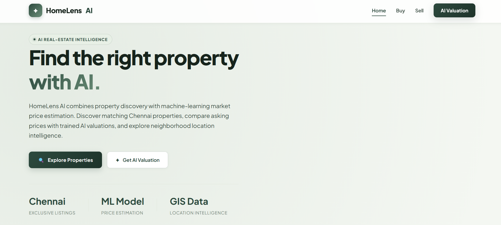
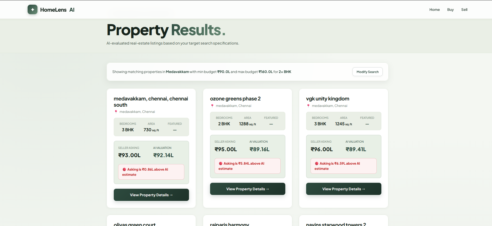
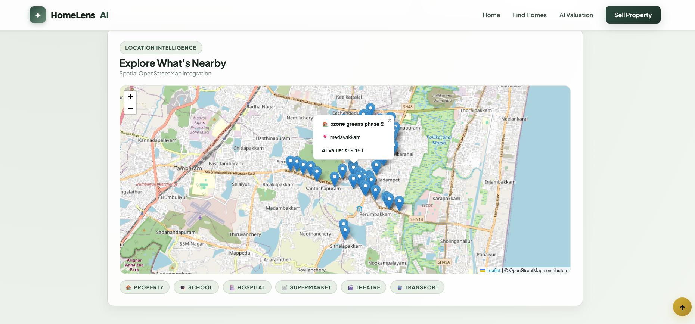

# 🏡 HomeLens AI

### AI-Powered Chennai House Price Prediction & Property Intelligence

🔗 **Live Demo:** https://home-lens-ai-six.vercel.app/

HomeLens AI is a machine learning based real-estate web application that predicts house prices in Chennai and helps users discover suitable properties using AI-powered valuation and location intelligence.

## 🚀 Features

- 🏠 Chennai House Price Prediction
- 🤖 AI-based Property Valuation
- 🔍 Smart Property Search & Filtering
- 📍 Location Intelligence using OpenStreetMap
- 🗺️ Nearby Schools, Hospitals, Supermarkets & Transport
- 📊 Exploratory Data Analysis
- 💡 Property Recommendations
- 👤 Buyer & Seller Tools
- 🌐 Deployed Web Application

## 🛠️ Technologies

- Python
- Flask
- Pandas
- NumPy
- Scikit-learn
- Joblib
- HTML5
- CSS3
- JavaScript
- Leaflet.js
- OpenStreetMap
- Vercel

## 🤖 Machine Learning

The project uses machine learning to estimate Chennai property prices based on:

- Location
- Area (sq.ft)
- BHK

The trained model is integrated with the Flask backend and used for real-time property valuation.

## 📸 Screenshots

### Home Page


### Property Search


### AI Valuation


### Location Intelligence


## ▶️ Run Locally

```bash
git clone https://github.com/ayishasiddika73-dotcom/HomeLens-AI.git
cd HomeLens-AI
pip install -r requirements.txt
python app.py